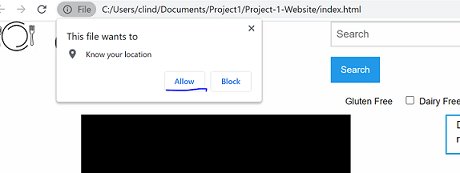
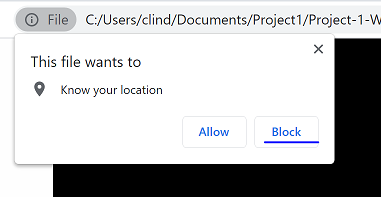

# Good Eats Website

## Description

Motivation for this project came from Raemarie's daughter who has many dietary restrictions and struggles to find recipes that suit her needs. We built this project as an easy resource for users to find meals that fit the criteria they provide. Throughout the project we learned how to utilize web APIs to get and supply our site with information, ranging from recipes to restaurants in in the user's area. As a team we also learned how to use GitHub branches and how to use the forking proces. We also learned how to use a new styling platform called Zurb Foundation/Foundation for Sites.

## Deployed link

    https://nicholas-herold.github.io/Project-1-Website/

## Installation

    Option 1: Access the site by utilizing the GitHub pages link provided

    Option 2: Get files from the GitHub Repository
    1) Initiate the local repository on your device:
        In terminal: navigate to the designated directory on your device.  Then use the command 'git init'

    2) Clone main branch to your device
        In terminal: issue the command '$ git clone repositoryHTTPSlinkcopied'

    3) Open code with IDE (Visual Studio, etc.)

    4) Open index.html file on default browser

## Usage

As a user
I WANT suggestions for a meal
SO THAT I can plan accordingly

  
GIVEN a foodie dashboard with form inputs 
WHEN I search for an ingredient, dietary restriction, and/or cooking method 
THEN I am presented with recipe suggestions meeting that criteria 

  
WHEN I select a recipe 
THEN I am presented with pop-up containing a picture of the recipe and a link to the recipe card located on another site 

  
WHEN I find a recipe I like 
THEN I am able to save a recipe to my favorites 

  
WHEN I load or refresh the application, it asks permission to know my location 
WHEN I allow the application to know my location 

 
THEN I am presented with a list of local restaurants including their phone numbers and addresses 

  
WHEN I deny the interface permission to know my location 

 
THEN no restaurants are displayed 

  
WHEN I enter a specific zip code 
THEN I am presented with a list of local restaurants including their phone numbers and addresses 

## Credits

Contributors

        Tyler Wheeler can be found at tylerwheeler92@gmail.com

        Raemarie Oatman can be found at raemarie.oatman@gmail.com

        Celina Lind can be found at clind323@gmail.com

        Nicholas Herold can be found at nherold86@gmail.com

Third Party APIs

        Edamam Recipe API => https://developer.edamam.com/

        Documenu Recipe API => https://documenu.com/docs#get_search_restaurants_geo

Styling Documentation

        Zurb Foundation => https://get.foundation/sites.html

## License

This is free and unencumbered software released into the public domain.

Anyone is free to copy, modify, publish, use, compile, sell, or
distribute this software, either in source code form or as a compiled
binary, for any purpose, commercial or non-commercial, and by any
means.

In jurisdictions that recognize copyright laws, the author or authors
of this software dedicate any and all copyright interest in the
software to the public domain. We make this dedication for the benefit
of the public at large and to the detriment of our heirs and
successors. We intend this dedication to be an overt act of
relinquishment in perpetuity of all present and future rights to this
software under copyright law.

THE SOFTWARE IS PROVIDED "AS IS", WITHOUT WARRANTY OF ANY KIND,
EXPRESS OR IMPLIED, INCLUDING BUT NOT LIMITED TO THE WARRANTIES OF
MERCHANTABILITY, FITNESS FOR A PARTICULAR PURPOSE AND NONINFRINGEMENT.
IN NO EVENT SHALL THE AUTHORS BE LIABLE FOR ANY CLAIM, DAMAGES OR
OTHER LIABILITY, WHETHER IN AN ACTION OF CONTRACT, TORT OR OTHERWISE,
ARISING FROM, OUT OF OR IN CONNECTION WITH THE SOFTWARE OR THE USE OR
OTHER DEALINGS IN THE SOFTWARE.

For more information, please refer to <https://unlicense.org>
